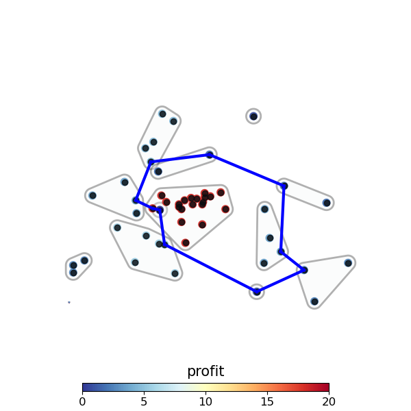

# The Clustered Orienteering Problem with Subgroups - COPS


This repository contains Python source code implementing two approaches, COPS-TABU and ILP, to solve the Clustered Orienteering Problem with Subgroups (COPS). COPS is a novel orienteering problem published in [.......](url for article), focusing on optimizing routes in clustered environments considering subgroups.

```
bibtex article
```




## Contents

- [Introduction](#introduction)
- [Dependencies](#dependencies)
- [Datasets](#datasets)  
- [Usage](#usage)
- [Results](#results)

## Introduction

The Clustered Orienteering Problem with Subgroups (COPS) deals with optimizing routes in clustered environments, where subgroups within clusters are considered for efficient navigation. This repository provides Python source code for two solving approaches: COPS-TABU, a heuristic approach, and COPS-ILP, an Integer Linear Programming formulation.

## Dependencies

- Python 3.7
- Another dependencies in requirements.txt
```
pip install -r requirements.txt
```
- [Gurobi (10.0.0)](https://www.gurobi.com/) license 

## Datasets


Datasets folder contains some instances examples of COPS. 

To create a new instance you will need to ...


## Usage 

### COPS-TABU

COPS-TABU can be run using tabu_search.py, example:
```
python tabu_search.py --path=.\datasets\11berlin52_T100_p2.cops
```

```
python tabu_search.py --help

usage: tabu_search.py [-h] [--path PATH] [--save_img SAVE_IMG]

execution arguments

optional arguments:
  -h, --help           show this help message and exit
  --path PATH          address of the file you want to run
  --save_img SAVE_IMG  True or False if you need to save the image result or
                       not, DEFAULT=True
```

### ILP

ILP can be run using ilp.py, example:

```
python ilp.py --path=.\datasets\11berlin52_T100_p2.cops
```

OBS: 
- ILP needs Gurobi license for running. If you want a [free Gurobi academic license](https://www.gurobi.com/features/academic-named-user-license/).
- ILP uses a huge amount of RAM, so its use is limited to problems with some vertices.

## Results


### Images

Results images are saved in ./datasets/img 

### Results information

Results information can be seen in ./datasets/results. The results path have a .csv file for each instance, with the following items:
- Name of the problem.
- Number of vertices.
- Number of subgroups.
- Number of clusters.
- Runtime in seconds.
- Profit of the route. 
- Distance of the route.
- Route indicated according to the vertex index.
- Subgroups index visited.
- Method used in the current solution (COPS_TABU or ILP)